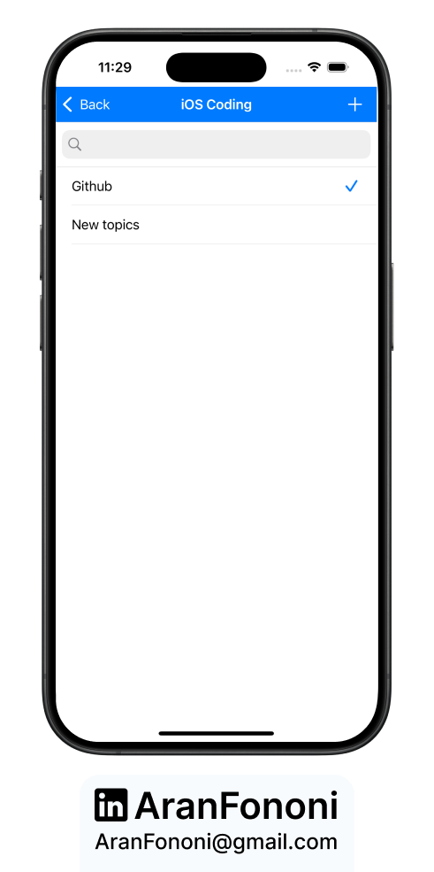
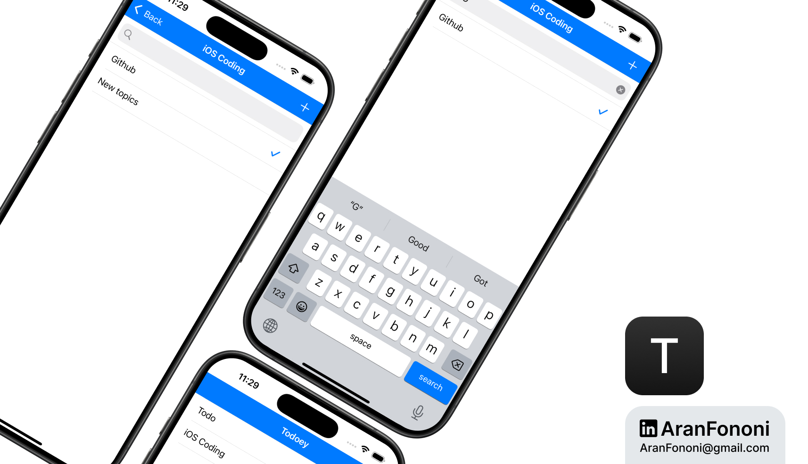

# Todoey - Core Data Version

### Project for Section 19: **Todo List Application with Core Data**  
This project was completed as part of Section 19 in the **Complete iOS Development Bootcamp** by Angela Yu.

## Project Overview
**Todoey** is a simple yet effective todo list application that allows users to manage their tasks. The app utilizes Core Data for data persistence, providing users with the ability to add, check, and uncheck items.

## What I Learned
In this project, I focused on:
- **Core Data Integration**: Implemented Core Data to handle data storage and retrieval.
- **TableView Management**: Utilized UITableView for displaying the list of todo items.
- **Search Functionality**: Implemented search functionality using UISearchBar to filter items.

## Key Skills
- Proficient in Core Data for data persistence
- Experience in managing UITableView and its data source
- Understanding of using predicates for filtering data in Core Data

## Additional Features
- Ability to add new todo items and mark them as completed.
- Search functionality to quickly find specific items.

---

### Project Preview

---

### Footer

---

## Contact
For more information, feel free to reach out:  
- **Email**: [aranfononi@gmail.com](mailto:aranfononi@gmail.com)  
- **LinkedIn**: [Aran Fononi](https://www.linkedin.com/in/aran-fononi-18182b265)
